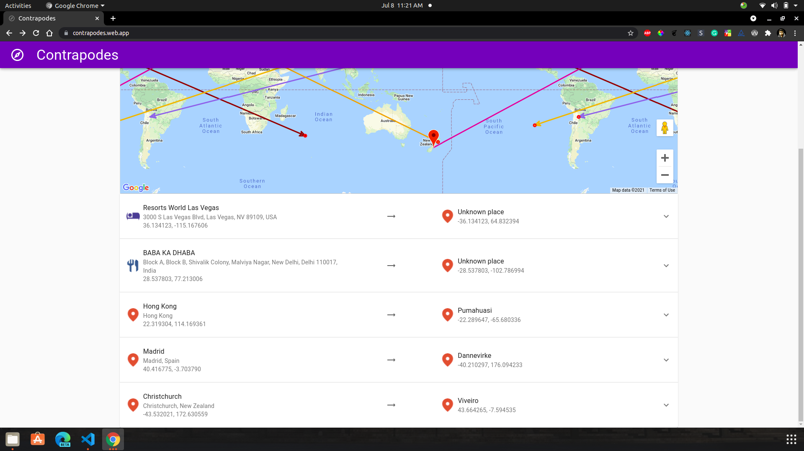
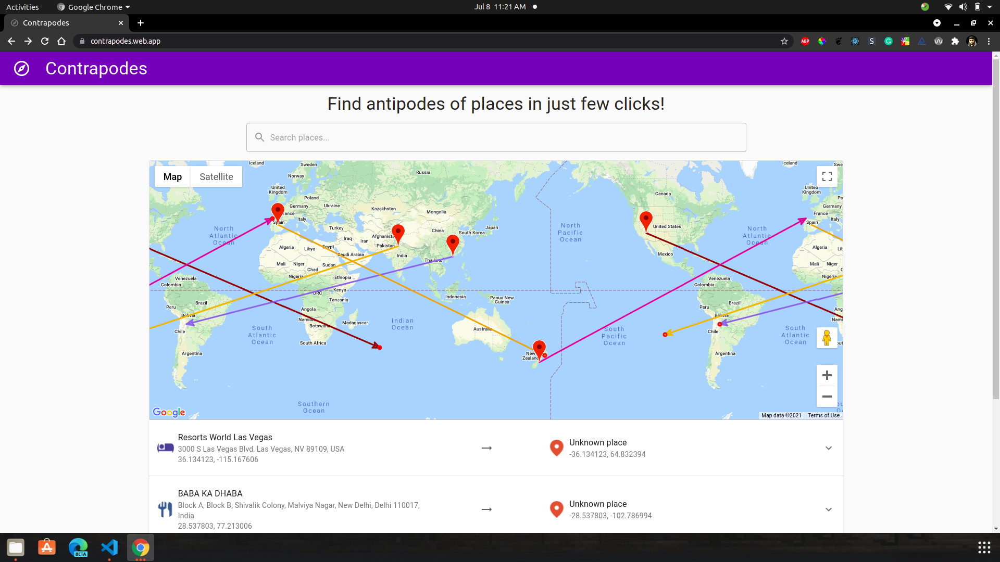
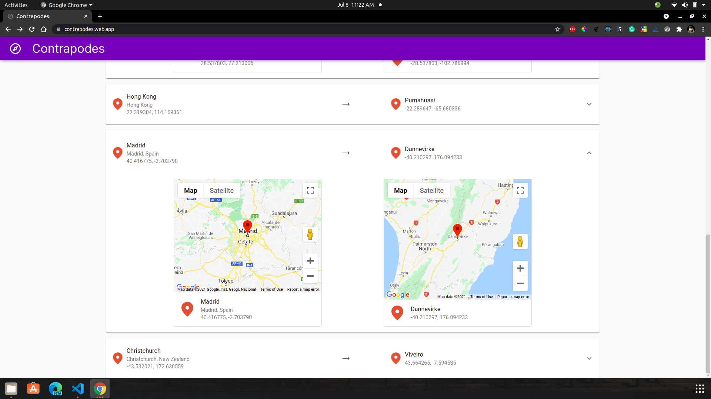
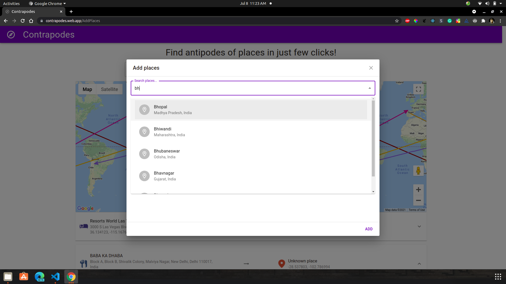
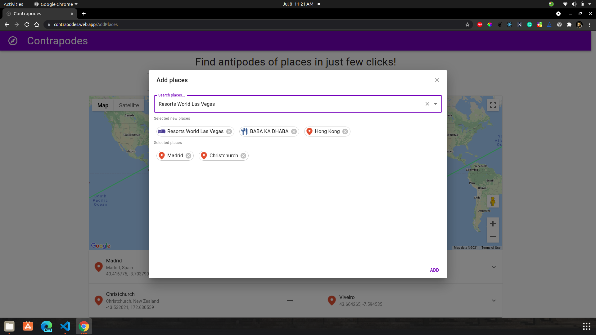
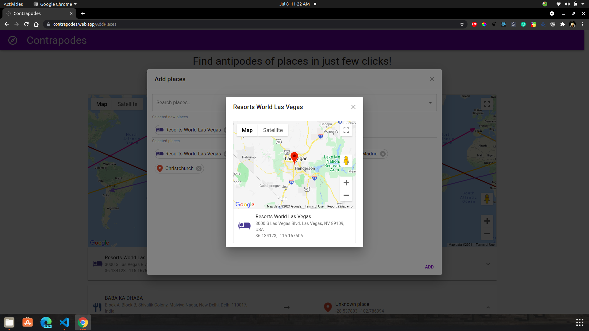
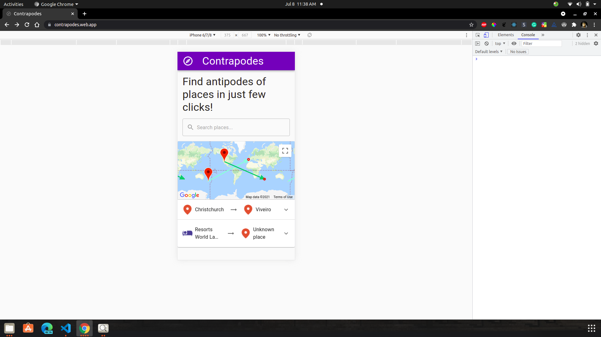

# Contrapodes 🧭

This project was bootstrapped with [Create React App](https://github.com/facebook/create-react-app).

## Live deployment

This project is deployed at [Contrapodes](https://contrapodes.web.app/) using GitHub actions integrated with Firebase

## Run locally

### `yarn install`
### `yarn start`

Runs the app in the development mode.
Open [http://localhost:3000](http://localhost:3000) to view it in the browser.

## Screenshots

